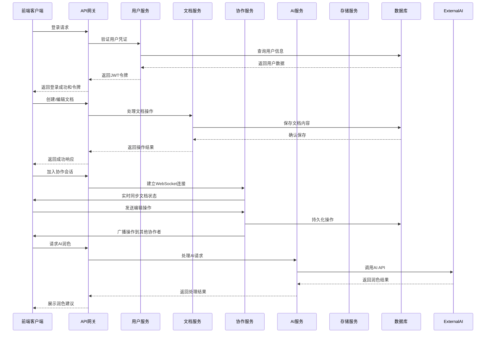

# 多端在线Markdown编辑器架构设计文档

## 1. 技术选型

### 1.1 后端技术栈
- **语言**: Java 17+
- **框架**: Spring Boot 3.0+
- **ORM**: MyBatis-Plus
- **数据库**: MySQL (支持Docker部署)
- **缓存**: Redis (用于会话管理、实时协作状态)
- **消息队列**: Kafka (用于实时协作消息传递)
- **认证**: JWT + OAuth2 (支持第三方登录)
- **文件存储**: MinIO / AWS S3 (存储图片和附件)
- **AI集成**: 本地Ollama部署的Qwen3.5大模型

### 1.2 前端技术栈
- **框架**: React 18 + TypeScript
- **状态管理**: Redux Toolkit
- **路由**: React Router
- **UI组件库**: Ant Design
- **Markdown编辑器**: Monaco Editor + markdown-it
- **实时协作**: Y.js + WebSocket
- **样式**: Tailwind CSS
- **构建工具**: Vite
- **PWA支持**: 实现离线编辑功能
- **SSR**: Next.js (可选，用于提升首屏加载速度)

## 2. 系统架构

### 2.1 整体架构
- **架构风格**: 微服务架构
- **模块划分**:
  - User Service: 用户管理、认证授权
  - Document Service: 文档管理、版本控制
  - Collaboration Service: 实时协作
  - AI Service: AI辅助功能
  - Storage Service: 文件存储
  - Notification Service: 通知服务

### 2.2 核心流程图

## 3. 核心模块设计

### 3.1 用户管理模块
- **功能**:
  - 用户注册、登录、注销
  - 个人资料管理
  - 权限管理（基于RBAC）
  - 第三方登录集成
- **数据模型**:
  - User: 用户基本信息
  - Role: 角色定义
  - Permission: 权限定义
  - UserRole: 用户-角色关联
  - RolePermission: 角色-权限关联

### 3.2 文档管理模块
- **功能**:
  - 文档创建、编辑、删除
  - 文件夹管理
  - 文档版本控制
  - 文档分享
  - 自动保存
- **数据模型**:
  - Document: 文档基本信息
  - DocumentContent: 文档内容
  - DocumentVersion: 文档版本
  - Folder: 文件夹信息
  - DocumentFolder: 文档-文件夹关联
  - ShareLink: 分享链接

### 3.3 实时协作模块
- **功能**:
  - 实时编辑同步
  - 协作状态管理
  - 操作冲突处理
- **技术实现**:
  - WebSocket连接管理
  - Y.js CRDT算法
  - 操作日志记录

### 3.4 AI辅助模块
- **功能**:
  - 文章润色
  - 摘要生成
  - 内容建议
- **技术实现**:
  - 本地Ollama部署的Qwen3.5大模型集成
  - 异步任务处理
  - 结果缓存

### 3.5 存储模块
- **功能**:
  - 图片上传
  - 附件管理
  - 文档导出
- **技术实现**:
  - 对象存储服务
  - 导出功能实现

### 3.6 插件系统
- **功能**:
  - 插件注册与管理
  - 插件生命周期控制
  - 插件API
- **技术实现**:
  - 前端插件机制
  - 后端插件接口

## 4. 数据库设计

### 4.1 核心表结构

#### users表
| 字段名 | 数据类型 | 描述 |
| :--- | :--- | :--- |
| id | VARCHAR(36) | 用户ID (UUID) |
| username | VARCHAR(255) | 用户名 |
| email | VARCHAR(255) | 邮箱 |
| password_hash | VARCHAR(255) | 密码哈希 |
| avatar | VARCHAR(255) | 头像URL |
| created_at | DATETIME | 创建时间 |
| updated_at | DATETIME | 更新时间 |

#### documents表
| 字段名 | 数据类型 | 描述 |
| :--- | :--- | :--- |
| id | VARCHAR(36) | 文档ID (UUID) |
| title | VARCHAR(255) | 文档标题 |
| user_id | VARCHAR(36) | 创建者ID |
| folder_id | VARCHAR(36) | 文件夹ID |
| is_public | TINYINT(1) | 是否公开 |
| created_at | DATETIME | 创建时间 |
| updated_at | DATETIME | 更新时间 |
| last_edited_by | VARCHAR(36) | 最后编辑者ID |
| last_edited_at | DATETIME | 最后编辑时间 |

#### document_contents表
| 字段名 | 数据类型 | 描述 |
| :--- | :--- | :--- |
| id | VARCHAR(36) | 内容ID (UUID) |
| document_id | VARCHAR(36) | 文档ID |
| content | TEXT | Markdown内容 |
| version | INT | 版本号 |
| created_at | DATETIME | 创建时间 |
| created_by | VARCHAR(36) | 创建者ID |

#### folders表
| 字段名 | 数据类型 | 描述 |
| :--- | :--- | :--- |
| id | VARCHAR(36) | 文件夹ID (UUID) |
| name | VARCHAR(255) | 文件夹名称 |
| parent_id | VARCHAR(36) | 父文件夹ID |
| user_id | VARCHAR(36) | 创建者ID |
| created_at | DATETIME | 创建时间 |
| updated_at | DATETIME | 更新时间 |

#### document_versions表
| 字段名 | 数据类型 | 描述 |
| :--- | :--- | :--- |
| id | VARCHAR(36) | 版本ID (UUID) |
| document_id | VARCHAR(36) | 文档ID |
| content | TEXT | 版本内容 |
| version_number | INT | 版本号 |
| created_at | DATETIME | 创建时间 |
| created_by | VARCHAR(36) | 创建者ID |
| comment | VARCHAR(255) | 版本注释 |

#### share_links表
| 字段名 | 数据类型 | 描述 |
| :--- | :--- | :--- |
| id | VARCHAR(36) | 分享链接ID (UUID) |
| document_id | VARCHAR(36) | 文档ID |
| token | VARCHAR(255) | 分享令牌 |
| permission | VARCHAR(50) | 权限类型 |
| expires_at | DATETIME | 过期时间 |
| created_at | DATETIME | 创建时间 |

## 5. 接口设计

### 5.1 用户接口
- **POST /api/auth/register**: 用户注册
- **POST /api/auth/login**: 用户登录
- **POST /api/auth/logout**: 用户注销
- **GET /api/users/me**: 获取当前用户信息
- **PUT /api/users/me**: 更新用户信息
- **GET /api/users/{id}**: 获取用户信息

### 5.2 文档接口
- **GET /api/documents**: 获取文档列表
- **POST /api/documents**: 创建文档
- **GET /api/documents/{id}**: 获取文档详情
- **PUT /api/documents/{id}**: 更新文档
- **DELETE /api/documents/{id}**: 删除文档
- **GET /api/documents/{id}/versions**: 获取文档版本历史
- **GET /api/documents/{id}/versions/{version}**: 获取特定版本
- **POST /api/documents/{id}/share**: 创建分享链接
- **GET /api/documents/shared**: 获取共享文档

### 5.3 文件夹接口
- **GET /api/folders**: 获取文件夹列表
- **POST /api/folders**: 创建文件夹
- **PUT /api/folders/{id}**: 更新文件夹
- **DELETE /api/folders/{id}**: 删除文件夹

### 5.4 协作接口
- **GET /api/collaboration/{documentId}/join**: 加入协作会话
- **POST /api/collaboration/{documentId}/leave**: 离开协作会话
- **GET /api/collaboration/{documentId}/users**: 获取当前协作用户

### 5.5 AI接口
- **POST /api/ai/improve**: 文章润色
- **POST /api/ai/summary**: 生成摘要
- **POST /api/ai/suggestions**: 获取内容建议

### 5.6 存储接口
- **POST /api/storage/upload**: 上传文件
- **GET /api/storage/{fileId}**: 获取文件
- **POST /api/documents/{id}/export**: 导出文档

### 5.7 插件接口
- **GET /api/plugins**: 获取插件列表
- **POST /api/plugins/install**: 安装插件
- **POST /api/plugins/uninstall**: 卸载插件

## 6. 部署方案

### 6.1 容器化部署
- **Docker容器**: 每个服务独立容器
- **Docker Compose**: 本地开发环境，支持Win11系统
- **Kubernetes**: 生产环境编排
- **Docker配置**: 提供Dockerfile和docker-compose.yml文件，确保在Win11系统上正常运行

### 6.2 本地开发环境
- **Win11 + Docker Desktop**: 本地开发和测试
- **MySQL容器**: 使用官方MySQL镜像
- **Redis容器**: 使用官方Redis镜像
- **Kafka容器**: 使用Confluent Kafka镜像
- **Ollama容器**: 部署Qwen3.5大模型

### 6.3 云服务部署
- **计算服务**: AWS EC2 / Alibaba Cloud ECS
- **数据库服务**: AWS RDS / Alibaba Cloud RDS
- **存储服务**: AWS S3 / Alibaba Cloud OSS
- **缓存服务**: AWS ElastiCache / Alibaba Cloud Redis
- **消息队列**: AWS SQS / Alibaba Cloud MQ

### 6.4 CI/CD流程
- **代码仓库**: GitHub / GitLab
- **CI工具**: Jenkins / GitHub Actions
- **部署环境**: 开发、测试、预发布、生产

## 7. 安全性考虑

### 7.1 认证与授权
- **JWT令牌**: 无状态认证
- **OAuth2**: 第三方登录集成
- **RBAC**: 基于角色的权限控制

### 7.2 数据安全
- **HTTPS**: 传输加密
- **密码哈希**: 存储安全
- **数据备份**: 定期备份
- **访问控制**: 细粒度权限管理

### 7.3 其他安全措施
- **CORS配置**: 跨域资源共享
- **Rate Limiting**: 防止暴力攻击
- **XSS防护**: 前端输入验证
- **SQL注入防护**: 后端参数化查询

## 8. 性能优化

### 8.1 前端优化
- **代码分割**: 按需加载
- **缓存策略**: 静态资源缓存
- **虚拟列表**: 长列表优化
- **WebSocket优化**: 消息压缩

### 8.2 后端优化
- **数据库索引**: 优化查询
- **连接池**: 数据库连接管理
- **缓存**: 热点数据缓存
- **异步处理**: 非阻塞操作

### 8.3 部署优化
- **负载均衡**: 多实例部署
- **自动扩缩容**: 根据负载调整
- **CDN**: 静态资源加速

## 9. 监控与日志

### 9.1 监控系统
- **Prometheus**: 指标监控
- **Grafana**: 可视化面板
- **AlertManager**: 告警管理

### 9.2 日志系统
- **ELK Stack**: 日志收集与分析
- **分布式追踪**: Jaeger / Zipkin

## 10. 扩展性考虑

### 10.1 水平扩展
- **服务无状态化**: 支持多实例部署
- **数据分片**: 数据库水平分片
- **消息队列**: 解耦服务间通信

### 10.2 功能扩展
- **插件系统**: 支持第三方插件
- **API网关**: 统一接口管理
- **微服务架构**: 独立部署与扩展

## 11. 技术风险与应对策略

### 11.1 技术风险
- **实时协作冲突**: 多人同时编辑导致的冲突
- **AI服务依赖**: 本地Ollama部署的资源占用和稳定性
- **存储成本**: 大量文件存储的成本
- **性能瓶颈**: 高并发下的性能问题

### 11.2 应对策略
- **CRDT算法**: 解决协作冲突
- **服务降级**: Ollama服务不可用时的降级方案
- **资源优化**: 合理配置Ollama资源使用
- **存储优化**: 压缩存储、过期清理
- **性能测试**: 定期性能测试与优化