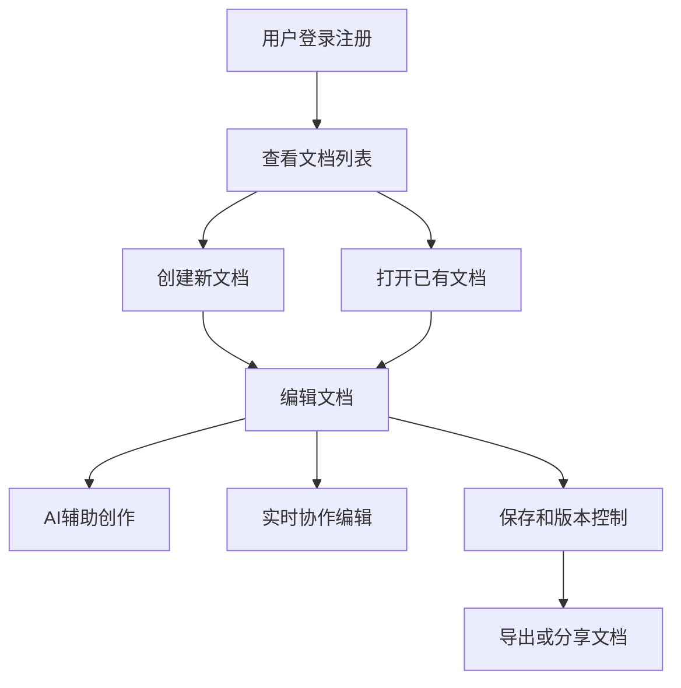

# 多端在线Markdown编辑器 - 产品需求文档

## 1. 产品概述
多端在线Markdown编辑器是一个功能丰富的协作式文档编辑工具，支持实时多人协作、AI辅助创作、版本控制和文档分享功能。
- 主要解决用户在撰写Markdown文档时缺乏协作、AI辅助和离线编辑能力的问题
- 目标用户为程序员、技术写作者和团队协作人员，提供高效、美观、易用的文档编辑体验

## 2. 核心功能

### 2.1 用户角色
| 角色 | 注册方式 | 核心权限 |
|------|---------------------|------------------|
| 普通用户 | 邮箱注册 | 创建编辑文档、文件夹管理、基本协作功能 |
| 管理员 | 邮箱注册 | 拥有所有功能权限、可管理用户和系统设置 |

### 2.2 功能模块
1. **认证授权模块**: 用户注册登录、JWT认证、第三方登录支持
2. **文档管理模块**: 文档CRUD操作、文件夹管理、版本控制、文档分享
3. **编辑器核心模块**: Markdown编辑器、实时预览、语法高亮、数学公式和Mermaid图表支持
4. **实时协作模块**: 多人同时编辑、冲突处理、协作用户状态管理
5. **AI辅助模块**: 文章润色、摘要生成、内容建议
6. **存储模块**: 文件上传下载、文档导出功能
7. **PWA离线编辑**: 离线状态下的文档编辑支持

### 2.3 页面详情
| 页面名称 | 模块名称 | 功能描述 |
|-----------|-------------|---------------------|
| 登录注册页 | 认证表单 | 用户登录、注册表单，支持第三方登录 |
| 文档列表页 | 文档导航 | 显示用户文档和文件夹、搜索过滤功能 |
| 编辑器页面 | Markdown编辑 | Monaco Editor集成、实时预览、工具栏、快捷键支持 |
| 个人设置页 | 用户管理 | 用户资料编辑、头像上传、账户设置 |
| 分享访问页 | 文档查看 | 通过分享链接访问文档，支持读写权限控制 |

## 3. 核心流程
用户首先注册登录系统，创建或打开已有文档进行编辑。编辑器支持Markdown语法高亮、实时预览、数学公式和Mermaid图表渲染。用户可邀请他人协作，通过WebSocket实时同步编辑内容。AI辅助功能可提供润色建议和摘要生成。文档支持版本控制，用户可随时恢复历史版本。用户可将文档导出为HTML、PDF或Markdown格式，或通过分享链接与他人共享。

## 4. 用户界面设计
### 4.1 设计风格
- 主色调：蓝色系（#1890ff），辅助色：灰色调
- 按钮风格：圆角矩形，悬停和点击效果流畅
- 字体：Inter、PingFang SC，字号从12px到24px按功能重要性区分
- 布局风格：三栏式（左侧导航、中间编辑区、右侧预览/设置）
- 图标风格：线性图标，清晰易懂

### 4.2 页面设计概述
| 页面名称 | 模块名称 | UI元素 |
|-----------|-------------|-------------|
| 编辑器页面 | 编辑区域 | Monaco Editor编辑器、语法高亮、行号、自动缩进 |
| 编辑器页面 | 实时预览 | 右侧分栏实时显示渲染后的Markdown内容 |
| 编辑器页面 | 工具栏 | 格式按钮、插入代码块、表格、链接等常用操作 |
| 文档列表页 | 文件夹树 | 可折叠的文件夹结构，支持拖拽排序 |
| 文档列表页 | 文档卡片 | 显示文档标题、最后修改时间、分享状态等 |

### 4.3 响应式设计
桌面端优先，支持移动端自适应布局，在小屏幕设备上编辑器和预览栏垂直排列，优化触摸操作体验。

## 5. 技术约束
- 前端：React 18 + TypeScript + Vite + Redux Toolkit + Ant Design
- 后端：Spring Boot 3.0+ + MyBatis-Plus + MySQL + Redis
- 实时协作：WebSocket + Y.js CRDT算法
- AI集成：本地Ollama部署Qwen3.5大模型
- 容器化：Docker + Docker Compose，支持Win11系统

